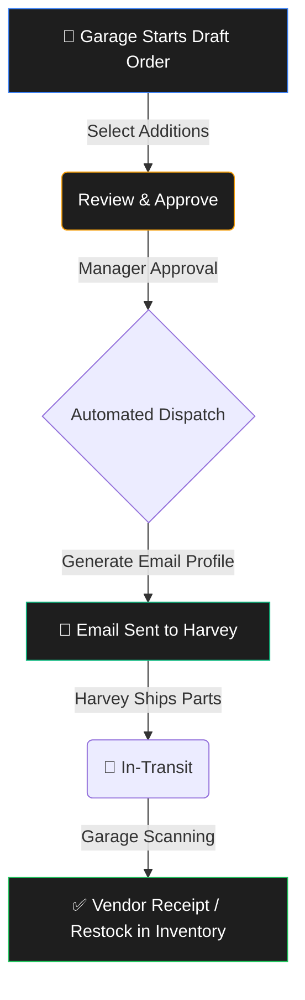

# SAMS Seat Insert Replacement Workflow

This wireframe manual visually outlines the end-to-end operational lifecycle of bus seat inserts within the SAMS platform. It covers everything from identifying a need on a bus, to executing the work order, right through sorting dirty seats and re-ordering from Harvey Shop.

---

## 1. Garage Inventory Command Centre

> [!NOTE] 
> The starting point for Garage Supervisors and Parts Clerks. This interface tracks physical `quantityOnHand`, alerts the user to `LOW_NEW_INVENTORY`, and highlights accumulations of `DIRTY` stock.


### Features
- **Stock Levels Tab**: Shows `quantityOnHand` for every Seat Insert Type.
- **Alerts Panel**: Highlights if `HIGH_DIRTY_INVENTORY` thresholds are breached.
- **Smart Actions**: 1-click "Create Batch" or "Order New" shortcuts.

---

## 2. Work Order Execution (Bus Needs a Seat)

> [!TIP] 
> When a bus rolls in needing a seat repair, a Work Order is created. The technician logs the `BusId` and assigns the precise `SeatInsertType` required for the fix. 


### Workflow Steps
1. **Work Order Generation**: Create a `WorkOrder` tagged to a specific Coach/Bus.
2. **Part Issue**: Appending the seat insert deducts stock (`ISSUE` transaction) automatically utilizing the No-Negative Guardian to ensure inventory validity.
3. **Dirty Seat Tagging**: The system marks the old `SeatInsert` status as `DIRTY`.

---

## 3. Reupholstery Returns & Redistribution (Harvey Shop)

> [!IMPORTANT]
> Garages cannot hold onto dirty stock indefinitely. The system groups used seats into a `ReupholsteryBatch` destined for Harvey Shop (Vendor).

````carousel
### Step 1: Packing a Batch
- Select all `DIRTY` seats from inventory.
- System transitions their status to `PACKED_FOR_RETURN`.
- Print a shipping manifest.
<!-- slide -->
### Step 2: In-Transit
- Ship batch to Harvey Shop.
- Individual seat status transitions to `IN_TRANSIT_TO_VENDOR`.
- Tracks `expectedReturnDate` to report on Vendor SLA Breaches.
<!-- slide -->
### Step 3: Harvey Redistribution
- Harvey Shop receives the batch (`AT_VENDOR`).
- After rebuilding the foam and hardware, Harvey ships fresh sets back.
````

---

## 4. Ordering Replacements from Harvey (Seat Orders)

> [!CAUTION]
> If a location simply needs more `NEW` seats and isn't sending a dirty batch, they issue a formal `SeatOrder`.

### Wireframe Diagram (Procurement Flow)



**Interface Details:**
- **Order Form:** Drop-down of compatible parts for the Garage's fleet type.
- **Approval Gate:** Supervisor signs off if quantities exceed typical thresholds.
- **Email Generation:** The system uses the `SEAT_ORDER_HARVEY` template to send a localized payload out.

---

## 5. Disposal & Damage Logging

> [!WARNING]
> If a seat has bent metal frames, deep foam damage, or severe graffiti, it may skip reupholstery entirely.

**Disposal Wireframe Setup**
- **Action Button:** "Scrap / Discard Item"
- **Reason Dropdown:** Select from System Enums (`TORN`, `GRAFFITI`, `FOAM_DAMAGE`, `HARDWARE_DAMAGE`).
- **Resolution:** Creates a `DisposalRecord` and executes a `SCRAP` inventory ledger transaction to permanently remove it from the books while retaining the audit trail.

---

## Summary of Transactions

| Action | Inventory Adjustment Type | Seat Status Result | Notes |
| :--- | :--- | :--- | :--- |
| **New Work Order** | `ISSUE` | `INSTALLED` | Validates `quantityOnHand > 0` |
| **Pack Reupholstery** | (None) | `PACKED_FOR_RETURN` | Grouped by `ReupholsteryBatch` |
| **Request Harvey Order**| (None) | `DRAFT` -> `SENT` | Automated `OutboundEmail` event |
| **Receive from Harvey** | `RECEIVE` | `NEW` | Increment `quantityOnHand` |
| **Log Damage** | `SCRAP` | `DISPOSED` | Generates `DisposalRecord` |
